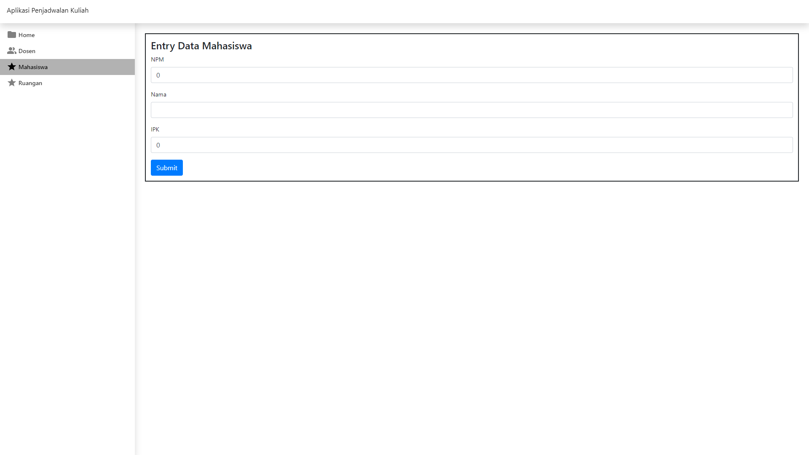

# Aplikasi Penjadwalan Kuliah

Aplikasi CRUD Penjadwalan Kuliah

|   Page    |                           Image                           |
| :-------: | :-------------------------------------------------------: |
|   Home    |   </img>    |
|   Dosen   |   </img>   |
| Mahasiswa | </img> |
|  Ruangan  |  </img>  |

## Project Setup

```sh
npm install
```

### Compile and Hot-Reload for Development

```sh
npm run dev
```

### Type-Check, Compile and Minify for Production

```sh
npm run build
```

### Lint with [ESLint](https://eslint.org/)

```sh
npm run lint
```
